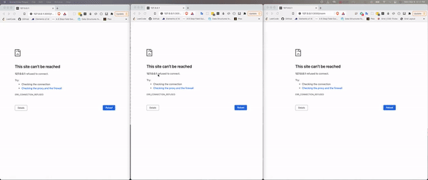

## GroupChat Express and WebSockets

> Simple app that demonstrates ChatRoom using Websockets
> Express.js and Node.js
> Websockets 
> https://icanhazdadjoke.com/ API

## Functionalities
> Ability to chat with anyone privately by entering '/priv username message'
> Change your username while chatting by typing /name newName
> Get a joke by entering /joke in the message box
> Chat with the group
> Get all members who are currently in the room by entering /members